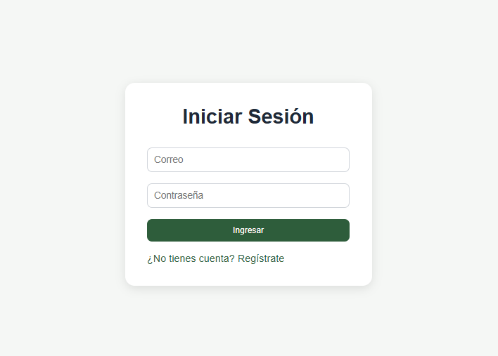
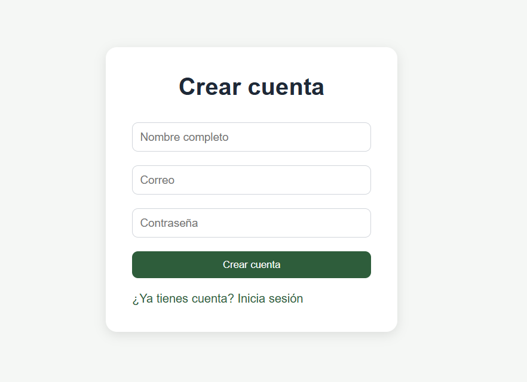
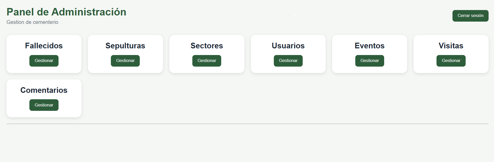
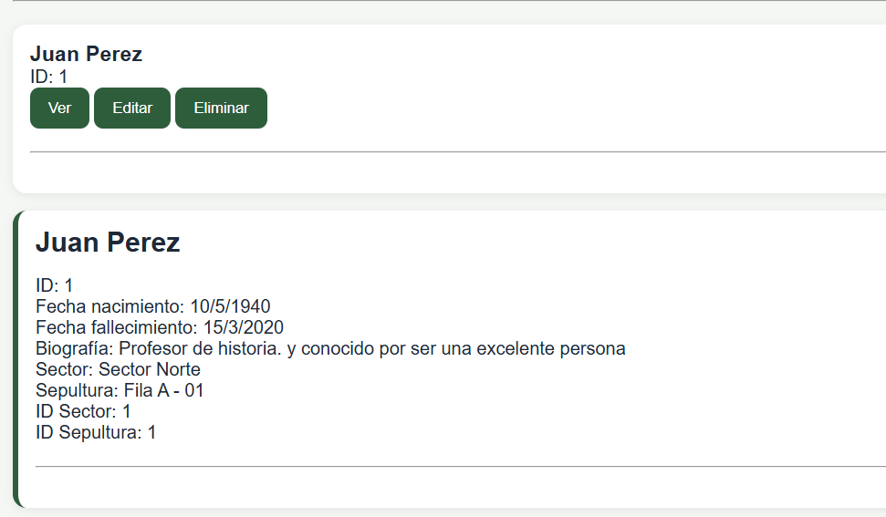
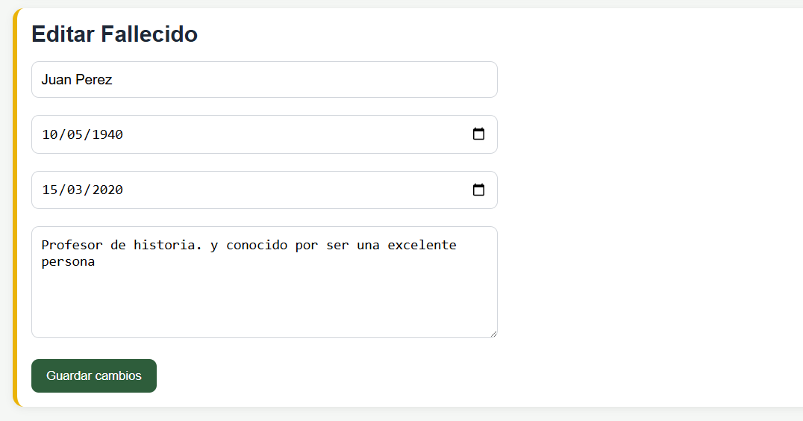
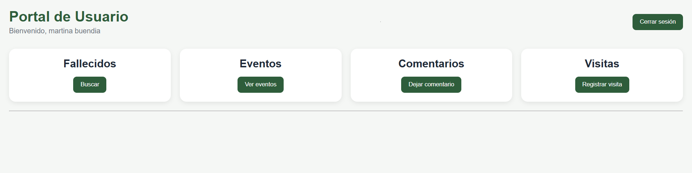
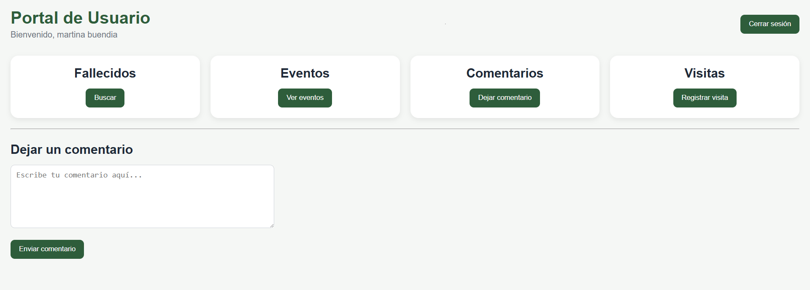

# Sistema de Gestión de Cementerio

## Descripción

Proyecto académico desarrollado para la administración y consulta de información de un cementerio.

El sistema permite gestionar fallecidos, sepulturas, sectores, eventos, visitas y usuarios mediante una base de datos PostgreSQL y una API REST construida con Node.js y Express.

Actualmente incorpora consultas avanzadas para búsqueda de fallecidos, disponibilidad de sepulturas y gestión de eventos.

---

## Tecnologías utilizadas

### Backend

* Node.js
* Express.js
* PostgreSQL
* pgAdmin 4

### Frontend

* HTML
* CSS
* JavaScript

### Herramientas

* Visual Studio Code
* Git
* GitHub

---

## Diagrama de clases


---

## Funcionalidades disponibles

### Autenticación

* Inicio de sesion con correo y contraseña.
* Registro de nuevos usuarios.
* Redireccion automatica segun el rol (admin o usuario).
* Cierre de sesion

### Panel de administración

#### Gestión de fallecidos

* Crear, buscar, editar y eliminar fallecidos.
* Buscar fallecidos por nombre, ID, rango de fechas o sector.
* Consultar detalle completo de un fallecido

#### Gestión de sepulturas

* Crear, buscar, editar y eliminar sepulturas.
* Buscar sepulturas por ID, estado o sector.

#### Gestión de sectores

* Crear, buscar, editar y eliminar sectores.
* Buscar sectores por ID o nombre.

#### Gestión de eventos

* Crear, buscar, editar y eliminar eventos.
* Buscar eventos por ID, nombre o rango de fechas.


#### Gestión de visitas

* Crear, buscar, editar y eliminar visitas.
* Buscar visitas por ID, fecha, usuario o tipo de visita.
* Consultar detalle de visitas con información del usuario.

#### Gestión de usuarios

* Crear, buscar, editar y eliminar usuarios.
* Buscar usuarios por ID, nombre, correo o rol.
* Modificar rol de usuarios.

#### Gestión de comentarios

* Crear, buscar, editar y eliminar comentarios.
* Buscar comentarios por ID, fecha, usuario o rol.

### Portal de usuario

* Buscar fallecidos por nombre, fecha de fallecimiento o sector.
* Ver detalle de un fallecido.
* Mini mapa de muestra que enseña sepulturas libres, ocupadas y resalta la ubicacion del fallecido.
* Ver eventos disponibles.
* Dejar comentarios.
* Registrar visitas seleccionando el tipo (mantenimiento, aniversario, duelo u otro).

---

## Instalación

### 1. Clonar repositorio

```bash
git clone https://github.com/brayannn1/cementerio-system.git
```

### 2. Entrar al proyecto

```bash
cd cementerio-system
```

### 3. Instalar dependencias

```bash
npm install
```

### 4. Restaurar base de datos

Importar el archivo SQL incluido en la carpeta correspondiente utilizando PostgreSQL o pgAdmin.


### 5. Configurar conexión

Modificar los datos de conexión en:

```bash
backend/basededatos.js
```

Ejemplo:

```javascript
const Pool = require('pg').Pool

const pool = new Pool({
    user: 'postgres',
    host: 'localhost',
    database: 'cementerio',
    password: 'tu_password',
    port: 5432
})
```

### 6. Iniciar servidor

```bash
node index.js
```

Servidor:

```bash
http://localhost:3000
```

### 7. Ejecutar frontend

Abrir el archivo:

```bash
frontend/login.html
```

o utilizar Live Server en Visual Studio Code.

---

## Capturas del proyecto

### Inicio de sesion



### Registro de usuario



## Panel Admin 



### Detalles de gestion
### Ejemplo busqueda



### Ejemplo Editar



## Panel usuario



### Detalles de funciones
### Ejemplo Dejar comentario



## Mejoras futuras

* Integración de mapa interactivo del cementerio.
* Visualización gráfica de sectores y sepulturas.
* Sistema de autenticación.
* Estadísticas y reportes.
* Visualización de ubicación exacta de sepulturas.

---

## Autores

* Brayan Vásquez
* Amaro Sandoval
* Nicolas San martin
* Benjamin Guzman
* Diego ramirez 

#### Ingeniería en Informática
