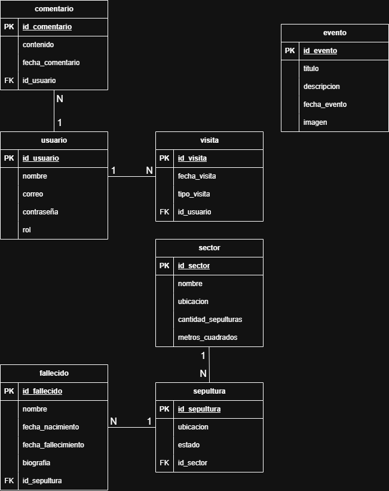
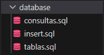
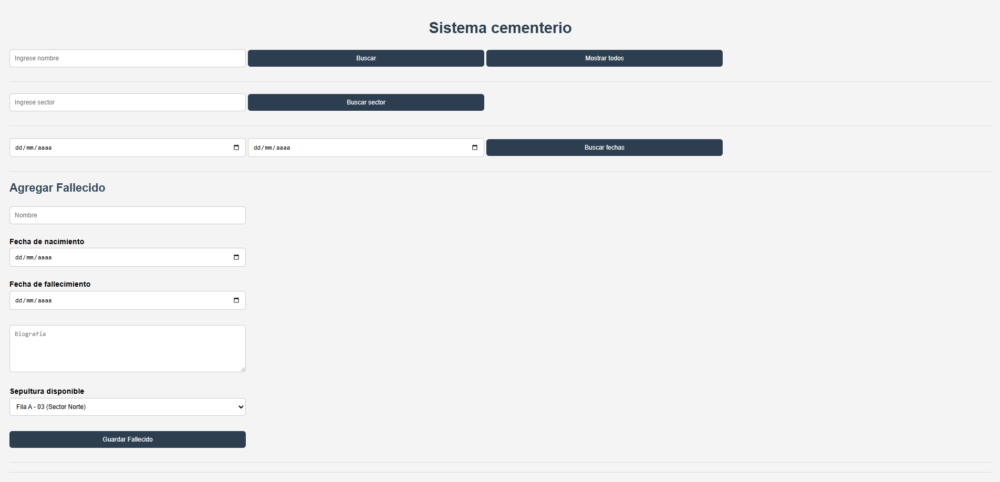
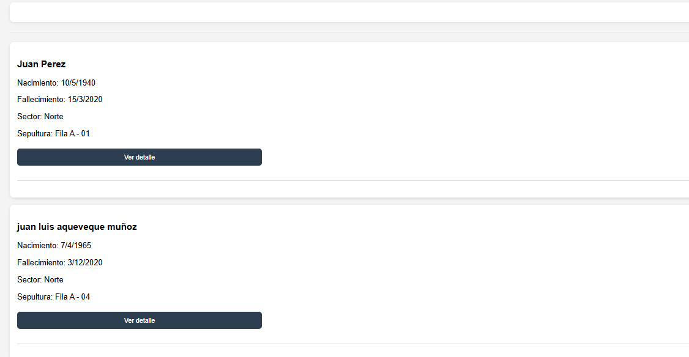
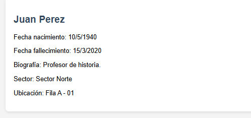

# Sistema de Gestión de Cementerio

## Descripción

Proyecto académico desarrollado para la administración y consulta de información de un cementerio.

El sistema permite gestionar fallecidos, sepulturas, sectores, eventos, visitas y usuarios mediante una base de datos PostgreSQL y una API REST construida con Node.js y Express.

Actualmente incorpora consultas avanzadas para búsqueda de fallecidos, disponibilidad de sepulturas y gestión de eventos.

---

## Tecnologías utilizadas

### Backend

* Node.js
* Express.js
* PostgreSQL
* pgAdmin 4

### Frontend

* HTML
* CSS
* JavaScript

### Herramientas

* Visual Studio Code
* Git
* GitHub

---

## Diagrama de clases



---

## Funcionalidades disponibles

### Gestión de fallecidos

* Registrar fallecidos.
* Listar todos los fallecidos.
* Buscar fallecidos por nombre.
* Consultar detalle de un fallecido.
* Buscar fallecidos por rango de fechas.
* Buscar fallecidos por sector.
* Consultar fallecidos más recientes.

### Gestión de sepulturas

* Registrar sepulturas.
* Consultar sepulturas disponibles.
* Consultar sepulturas ocupadas.
* Listar sepulturas libres.
* Obtener sector con mayor ocupación.

### Gestión de sectores

* Registrar sectores.
* Consultar disponibilidad por sector.

### Gestión de eventos

* Registrar eventos.
* Consultar eventos próximos.
* Consultar próximo evento.
* Buscar eventos por fecha.
* Buscar eventos por título.

### Gestión de visitas

* Registrar visitas.
* Consultar visitas por usuario.
* Consultar cantidad de visitas por usuario.
* Consultar detalle de visitas.

### Frontend

* Búsqueda de fallecidos.
* Visualización de resultados.
* Visualización de detalles.
* Registro de nuevos fallecidos.

---

## Instalación

### 1. Clonar repositorio

```bash
git clone https://github.com/brayannn1/cementerio-system.git
```

### 2. Entrar al proyecto

```bash
cd cementerio-system
```

### 3. Instalar dependencias

```bash
npm install
```

### 4. Restaurar base de datos

Importar el archivo SQL incluido en la carpeta correspondiente utilizando PostgreSQL o pgAdmin.



### 5. Configurar conexión

Modificar los datos de conexión en:

```bash
backend/basededatos.js
```

Ejemplo:

```javascript
const Pool = require('pg').Pool

const pool = new Pool({
    user: 'postgres',
    host: 'localhost',
    database: 'cementerio',
    password: 'tu_password',
    port: 5432
})
```

### 6. Iniciar servidor

```bash
node index.js
```

Servidor:

```bash
http://localhost:3000
```

### 7. Ejecutar frontend

Abrir el archivo:

```bash
frontend/index.html
```

o utilizar Live Server en Visual Studio Code.

---

## Capturas del proyecto

### Pantalla principal



### Búsqueda de fallecidos



### Detalle de fallecido



---

## Mejoras futuras

* Integración de mapa interactivo del cementerio.
* Visualización gráfica de sectores y sepulturas.
* Sistema de autenticación.
* Panel administrativo.
* Estadísticas y reportes.
* Visualización de ubicación exacta de sepulturas.

---

## Autores

* Brayan Vásquez
* Amaro Sandoval
* Nicolas San martin
* Benjamin Guzman
* Diego ramirez 

#### Ingeniería en Informática
